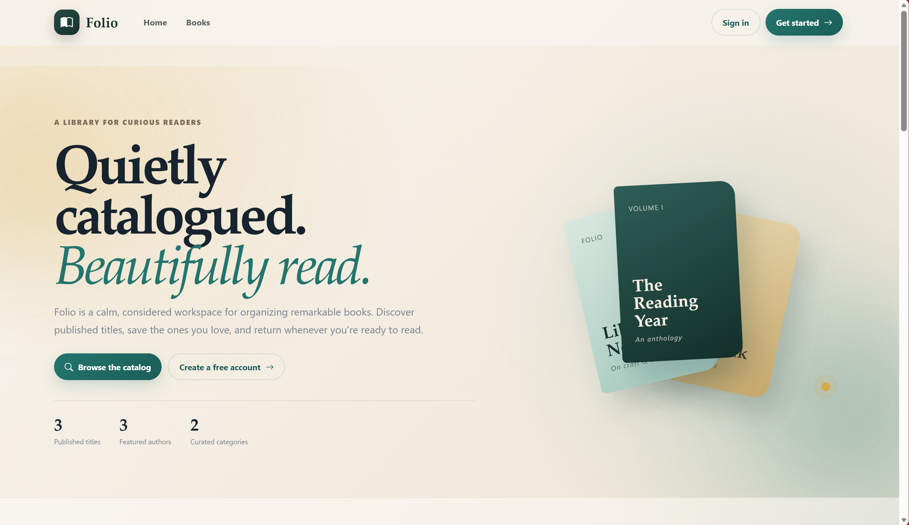
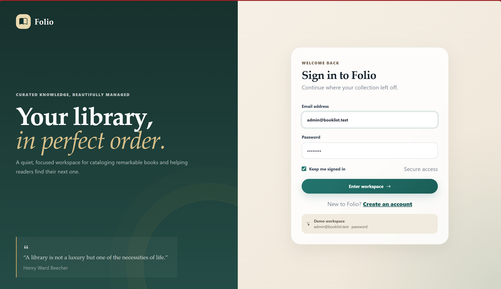
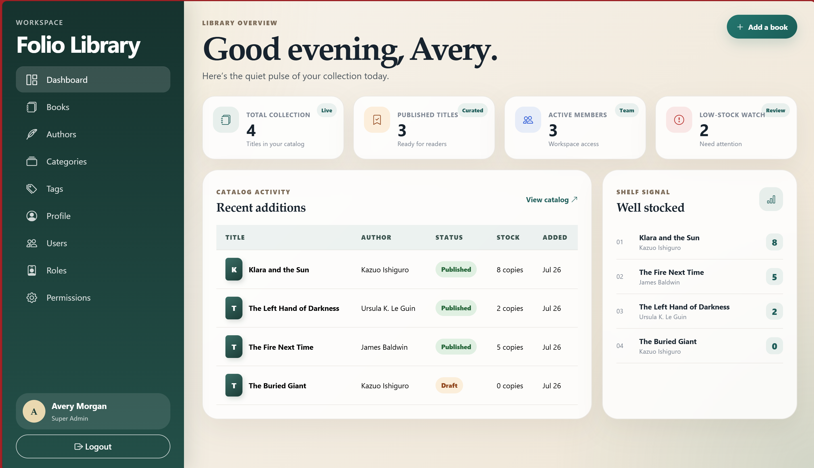

<p align="center">
  <h1 align="center">BookStock Management System with RBAC</h1>
  <p align="center">A demo project of modern, elegant book stock management system built with Laravel and Vue.js</p>
</p>

<p align="center">
  <a href="https://github.com/yourusername/anotherstockbook/stargazers">
    
  </a>
  <a href="https://github.com/yourusername/anotherstockbook/network/members">
    
  </a>
  <a href="https://github.com/yourusername/anotherstockbook/issues">
    
  </a>
</p>

---

## ✨ About

**StockBook** is a beautifully designed library management system that helps you organize your book collection with ease. Built with modern technologies and a focus on user experience, it provides a seamless interface for managing books, authors, categories, and more.

Whether you're managing a personal library or a community bookshelf, StockBook offers all the tools you need in an elegant, intuitive interface.

---

## 📸 Demo Screenshots

<p align="center">
  
</p>

<p align="center">
  
</p>

<p align="center">
  
</p>

---

## 🚀 Features

### 📖 **Public Catalog**
- Beautiful public book catalog with search and filtering
- Detailed book view with cover images, descriptions, and metadata
- Featured books highlighting
- Responsive design for all devices

### 👨‍💼 **Admin Dashboard**
- **Dashboard** - Overview with key metrics and statistics
- **Book Management** - Full CRUD operations with rich text editor
- **Author Management** - Manage author profiles and bios
- **Category Management** - Organize books into categories
- **Tag Management** - Add tags for better book discovery
- **User Management** - Manage user accounts and roles
- **Role & Permission System** - Granular access control with customizable permissions
- **Lookup Management** - Manage reference data

### 👥 **Member Area**
- Personal dashboard with reading statistics
- **Bookmarks** - Save and organize favorite books
- **Profile Management** - Update personal information
- Reading history and recommendations

### 🔐 **Authentication System**
- Secure login and registration
- Role-based access control
- Password reset functionality
- Session management

### 🎨 **Design & UX**
- Modern, clean UI with custom SCSS styling
- Responsive design for mobile, tablet, and desktop
- Smooth animations and transitions
- Accessibility-focused components
- Dark/light theme support

---

## 🏗️ Project Structure

```
anotherstockbook/
├── app/
│   ├── Http/
│   │   ├── Controllers/
│   │   │   ├── Admin/           # Admin panel controllers
│   │   │   ├── Member/          # Member area controllers
│   │   │   ├── Public/          # Public-facing controllers
│   │   │   └── Auth/            # Authentication controllers
│   │   └── Middleware/          # Request middleware
│   ├── Models/                  # Eloquent models
│   └── Providers/               # Service providers
├── database/
│   ├── migrations/              # Database migrations
│   ├── seeders/                 # Database seeders
│   └── factories/               # Model factories
├── public/                      # Public assets
├── resources/
│   ├── js/
│   │   ├── Components/          # Reusable Vue components
│   │   ├── Layouts/             # Vue layout components
│   │   ├── Pages/               # Page components
│   │   │   ├── Admin/           # Admin pages
│   │   │   ├── Member/          # Member pages
│   │   │   ├── Public/          # Public pages
│   │   │   └── Auth/            # Auth pages
│   │   └── composables/         # Vue composables
│   ├── scss/
│   │   └── app.scss             # Main stylesheet
│   └── views/
│       └── app.blade.php        # Main Blade template
├── routes/
│   └── web.php                  # Web routes
├── config/                      # Configuration files
├── composer.json                # PHP dependencies
├── package.json                 # Node dependencies
└── vite.config.js               # Vite configuration
```

---

## 🛠️ Tech Stack

| Technology | Description |
|------------|-------------|
| **Laravel 11** | PHP framework for backend logic |
| **Vue.js 3** | Frontend JavaScript framework |
| **Inertia.js** | Seamless server/client rendering |
| **Vite** | Fast build tool and dev server |
| **SCSS** | CSS preprocessor for styling |
| **Bootstrap Icons** | Icon library |
| **MySQL** | Database management |
| **Tailwind CSS** | Utility-first CSS framework |

---

## 📦 Installation

### Prerequisites

- PHP 8.2 or higher
- Composer
- Node.js 18+ and npm
- MySQL 8.0+ or SQLite
- Git

### Step-by-Step Installation

1. **Clone the repository**
   ```bash
   git clone https://github.com/mmahfoozurrahman/stockbook-laravel-vue-inertia-with-rbac
   cd stockbook-laravel-vue-inertia-with-rbac
   ```

2. **Install PHP dependencies**
   ```bash
   composer install
   ```

3. **Install JavaScript dependencies**
   ```bash
   npm install
   ```

4. **Create environment file**
   ```bash
   cp .env.example .env
   ```

5. **Generate application key**
   ```bash
   php artisan key:generate
   ```

6. **Configure database**
   
   Update your `.env` file with your database credentials:
   ```env
   DB_CONNECTION=mysql
   DB_HOST=127.0.0.1
   DB_PORT=3306
   DB_DATABASE=anotherstockbook
   DB_USERNAME=your_username
   DB_PASSWORD=your_password
   ```

7. **Run database migrations**
   ```bash
   php artisan migrate
   ```

8. **Seed the database (optional)**
   ```bash
   php artisan db:seed
   ```

9. **Build frontend assets**
   ```bash
   npm run build
   ```

10. **Start the development server**
    ```bash
    php artisan serve
    ```

11. **Access the application**
    
    Open your browser and visit: `http://localhost:8000`

---

## 🔧 Development

### Running in Development Mode

```bash
# Terminal 1 - Start Laravel backend
php artisan serve

# Terminal 2 - Start Vite dev server
npm run dev
```

### Building for Production

```bash
npm run build
```

### Running Tests

```bash
php artisan test
```

---

## 📱 Key Features in Detail

### Book Management
- Add, edit, and delete books with rich metadata
- Upload cover images
- Assign authors, categories, and tags
- Track stock and publication status
- Rich text editor for book descriptions

### Role-Based Access Control
- Custom roles (Admin, Member, etc.)
- Granular permissions system
- User-role assignments
- Permission-based UI visibility

### Responsive Design
- Mobile-first approach
- Optimized for all screen sizes
- Touch-friendly interactions
- Fast loading times

---

## 📄 License

This project is licensed under the MIT License - see the [LICENSE](LICENSE) file for details.

---

## 🙏 Acknowledgments

- Built with [Laravel](https://laravel.com/)
- Frontend powered by [Vue.js](https://vuejs.org/)
- Styled with [Bootstrap Icons](https://icons.getbootstrap.com/)
- Icons by [Bootstrap Icons](https://icons.getbootstrap.com/)

---

<p align="center">
  If you found this project useful, please consider giving it a ⭐ star on GitHub!
</p>
  
